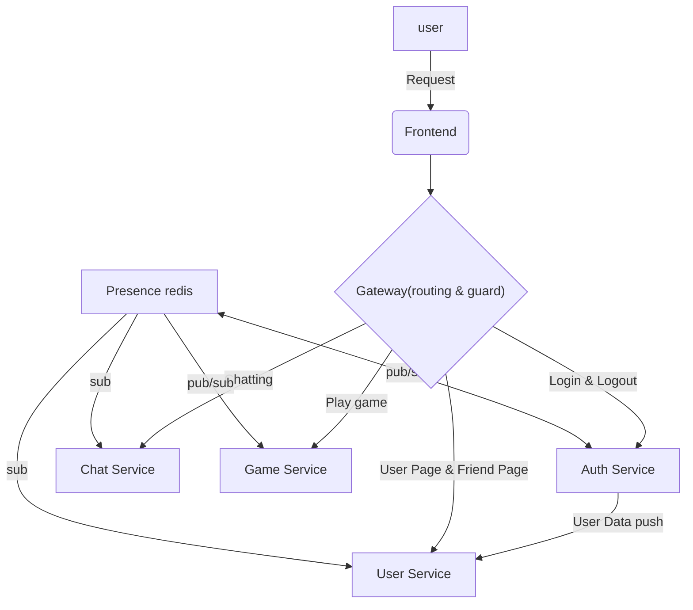

*This project has been created as part of the 42 curriculum by daeunki2, ...*

# 1. Team

## 1.1 Team Information
- daeunki2, suna, chanypar, tronguye

## 1.2 Project Management
- git 버전관리 + team_log 작성 한거 서술
- 메신저 어플로 소통 + 정기 회의 진행
- 같이 공부하고 설계잡고 일정 나눔

## 1.3 Individual Contributions
To maintain high agility, we did not divide the team into strict "Frontend vs Backend" roles. Instead, **all members acted as Full-Stack Developers**, but we assigned specific administrative and architectural leads to ensure project stability:

1. **daeunki2 : Product Owner + Technical Lead + Project Manager + Full-Stack Developers**
	• Founded the project group and defined the overall product vision and direction.
  	• Led the team's sprint coordination while contributing to the full-stack implementation alongside all members.
2. **suna : Project Manager + Technical Lead + Full-Stack Developers**
	• Defined the technical architecture and implementation direction for their assigned services.
	• Developed core full-stack features from end to end.
3. **chanypar : Project Manager + Technical Lead + Full-Stack Developers**
	• Defined the technical architecture and implementation direction for their assigned services.
	• Developed core full-stack features from end to end.
4. **tronguye : Technical Lead + Front Developer**
  • Managed final bug fixing, error handling, and real-world integration testing to stabilize the application(e2e).
---

# 2. Project Overview

## 2.1 Description
### (1) Project Name
- ft_Pong
### (2) Goal
- **Hands-on Learning of Core Web Concepts:** We chose to build a Pong game to deeply understand and implement fundamental web communication protocols from scratch, specifically REST APIs and real-time WebSockets.
- **Experiencing Modern Architecture:** By building a decoupled Microservices Architecture (MSA), we learned firsthand how production-level, large-scale systems operate, communicate, and ensure fault isolation.
- **Focus on the Journey of Architectural Decisions:** Rather than simply checking off features to rush the project to completion, our ultimate focus was on the engineering process itself—deliberately analyzing how to structure our services, weighing architectural trade-offs, and choosing the right technology for each specific scenario.

### (3) Key Features

### 🚀 1. Loosely Coupled Microservices Architecture (MSA)
* **Domain Isolation:** Separated application core into 4 distinct Dockerized microservices—**Auth, User, Chat, and Game**—orchestrated through a centralized Nginx API Gateway to maximize fault isolation and scalability.
* **Event-Driven Presence Layer:** Integrated a **Redis Pub/Sub** network to synchronize live user presence states (Online/Offline/In-Game) cross-services smoothly without direct HTTP coupling.

### ⚡ 2. High-Performance 60 FPS Game Engine & Sync
* **Server-Side Physics Engine:** Implemented a robust game loop executing at a strict **60 FPS** on the backend to enforce state authority and eliminate client-side cheating or interpolation manipulation.
* **Resilient Connection-Drop Handling:** Engineered an immediate socket disconnection hook via WebSockets (Socket.io) that instantly detects link failures, gracefully resolves active game sessions, updates the Postgres DB, and awards forfeit victories to remaining players.

### 🔌 3. Scalable WebSockets Infrastructure (Chat, Game & Presence)
* **Full-Duplex Socket Architecture:** Designed and managed a centralized WebSockets (Socket.io) infrastructure to handle heavy concurrent connection lifecycles across distinct domains including real-time chatting, instant game invitations, and live global status syncing.
* **Stateful Connection Management:** Engineered custom socket-room management and multiplexing logic, allowing seamless peer-to-peer message routing within secure 1:1 DM sessions and instant, atomic synchronization of "Ready" status toggles within game matchmaking lobbies.

### 🎨 4. Dynamic UI/UX Theme Engine & Internationalization (Frontend)
* **Context-Driven Theme Switching:** Built a fully custom responsive UI from scratch featuring distinct **"Retro"** and **"Future"** concept themes toggleable via a single click. The UI dynamically transforms not just the color palette, but adapts the entire visual style and layout components to fit the selected aesthetic.
* **Native Multi-Language Support:** Integrated a scalable Internationalization (i18n) translation pipeline dynamically supporting **Korean, English, and French**, allowing instantaneous client-side layout adjustments without forcing application reloads.

### 🔐 5. Dual-Token Security Infrastructure with RTR
* **Strict Session Hijacking Defense:** Enforced a robust custom authentication system leveraging a dual-token standard (**Access & Refresh tokens**) delivered entirely via secure **HTTP-only browser cookies**.
* **Refresh Token Rotation (RTR):** Programmed an active rotation pipeline that invalidates used/compromised token chains immediately upon verification, mitigating replay attacks.
* **Role-Based Guards:** Designed targeted NestJS Authorization Guards to strictly separate "Guest" and "Registered User" interaction layers at the API route level.

### 📊 6. High-Availability Infrastructure Monitoring & Health Checks
* **Continuous Endpoint Verification:** Configured automated live health-check endpoints for all containerized microservices to ensure continuous service availability and rapid fault detection.
* **Centralized Live Status Dashboard:** Integrated **Uptime Kuma** to monitor real-time container status, response latency, and system uptime, guaranteeing high availability (HA) across the entire decentralized infrastructure.

## 2.2 Features List
- 친구 추가
- 프로필 변경
-

## 2.3 Modules

### (1) Selected Modules (Major / Minor + Points)
| Category | Module Name | Type | Points |
| :--- | :--- | :---: | :---: |
| **Web & Infrastructure** | Frontend & Backend Framework Integration | Major | 2 pts |
| | Real-time WebSockets Presence System | Major | 2 pts |
| | User Interaction & Relationship Management | Major | 2 pts |
| | Object-Relational Mapping (ORM) Integration | Minor | 1 pt |
| | Real-time Collaboration (Synchronized Game Lobby) | Minor | 1 pt |
| | Custom UI/UX Design & Theme Engine | Minor | 1 pt |
| | File Upload & Management (User Avatar Pipeline) | Minor | 1 pt |
| **Accessibility** | Multi-language Support (English / Korean / French) | Minor | 1 pt |
| **User Management** | Basic User Management & JWT Authentication | Major | 2 pts |
| | Match Statistics & Historical Game Logs | Minor | 1 pt |
| | Advanced Authorization System (RBAC via Guards) | Minor | 1 pt |
| **Artificial Intelligence** | AI Opponent Implementation (Server-side Bot) | Major | 2 pts |
| **Gaming Experience** | Fully Playable Server-side Web Game (Pong) | Major | 2 pts |
| | Remote Live Multiplayer Play (Low Latency) | Major | 2 pts |
| **DevOps & Monitoring** | Decentralized Microservices Architecture (MSA) | Major | 2 pts |
| | Container Health Checks & Live Status Dashboard | Minor | 1 pt |
| **Total Score** | **16 Modules Implemented** | | **24 pts** |

### (2) Why We Chose These Modules

### (3) How They Were Implemented
#### 🌐 1. Web & Infrastructure (10 Points)
* **Frontend & Backend Framework (2 pts):** Built using a modern decoupled architecture—utilizing NestJS for a structured backend enterprise environment and React for a dynamic, component-driven client interface.
* **Web Socket Online (2 pts):** Implemented global, bi-directional state synchronization via Socket.io to manage and broadcast live user presence status (Online, Offline, In-Game) seamlessly.
* **User Interaction (2 pts):** Developed comprehensive social features including real-time Direct Messaging (DM), friend request systems.
* **ORM (1 pt):** Utilized TypeORM to seamlessly map relational business logic with our PostgreSQL database, ensuring type safety and efficient database migrations.
* **Real-time Collaboration (1 pt):** Developed synchronized game wating queue where a live session is automatically triggered for all connected participants once 2 players toggle their "Ready" status.
* **Custom Design (1 pt):** Crafted a fully custom, responsive user interface without relying on off-the-shelf pre-made templates. It features distinct "Retro" and "Future" concept themes toggleable via a single click, which dynamically transforms not only the color palette but also the entire visual style and layout components to match the active aesthetic.
* **File Upload (1 pt):** Allowed users to directly upload and customize their personal profile avatars. This features a secure, end-to-end file processing pipeline built with Multer that includes strict file size boundaries and extension validation (e.g., JPEG, PNG) to safeguard server-side storage.

#### 🌍 2. Accessibility & Internationalization (1 Point)
* **Multi-language Support (1 pt):** Integrated internationalization (i18n) workflows to natively support English, Korean, and French, dynamically adjusting layout components based on user language preferences.

#### 🔐 3. User Management & Security (4 Points)
* **Basic User Management & Auth (2 pts):** Implemented a complete custom authentication infrastructure featuring a dual-token system (Access & Refresh tokens) secured via HTTP-only browser cookies. To guarantee high-level security against session hijacking, we enforced a strict Refresh Token Rotation (RTR) mechanism that securely monitors and rotates tokens upon every verification lifecycle.
* **Game Statistics & Match History (1 pt):** Integrated a dedicated match history section within the user profile page. This allows players to review recent match logs at a glance, dynamically fetching and rendering game results, final scores, and opponent details directly from the database.
* **Advanced Authorization System (1 pt):** Enforced Role-Based Access Control (RBAC) via custom NestJS Guards to dynamically differentiate between "Guest" and "Registered User" accounts, restricting unauthorized access to core user features and locking down specific API endpoints.

#### 🤖 4. Artificial Intelligence (2 Points)
* **AI Opponent (2 pts):** Programmed a server-side automated game bot using physics-predictive algorithms, offering players an offline/training alternative to live matchmaking.

#### 🏓 5. Game & User Experience (4 Points)
* **Fully Playable Web Game (2 pts):** Developed a fully compliant implementation of classic Pong utilizing an independent server-side physics engine to prevent client-side manipulation.
* **Remote Live Play (2 pts):** Optimized low-latency multiplayer syncing across remote socket connections, running at a smooth and precise 60 FPS rendering rate. This includes a robust connection-drop handling system that instantly detects socket disconnections to gracefully forfeit matches upon unexpected user dropouts.

#### 🚀 6. DevOps & Monitoring (3 Points)
* **Microservices (2 pts):** Decoupled system responsibilities into individual Dockerized microservices—specifically isolating Auth, User, Chat, and Game services—to achieve a loosely coupled architecture bound by a centralized Nginx API Gateway. To efficiently sync live data without direct coupling, we integrated a Redis Pub/Sub presence layer that allows services to dynamically subscribe and fetch real-time user status updates.
* **Health Check & Status Page (1 pt):** Configured continuous service monitoring and health checks across all containerized microservices utilizing Uptime Kuma. This provides a centralized live status dashboard that tracks endpoint availability in real time to ensure high availability.
  
## 2.4 Technical Stack

### (1) Frontend
* **React & TypeScript:** Utilized to build a scalable, type-safe Single Page Application (SPA) with efficient component reusability.
* **Context API & Tailored CSS:** Engineered a fully custom style system without relying on pre-made external templates, implementing an on-the-fly "Retro" and "Future" concept theme-switching engine.
* **i18next (Internationalization):** Integrated a client-side translation pipeline to deliver seamless, native live-switching between Korean, English, and French.
* **Socket.io-client:** Established persistent full-duplex WebSockets connections to handle real-time chat sync, presence updates, and low-latency game 60 FPS state rendering.

### (2) Backend
* **NestJS (Node.js framework):** Adopted for its highly structured, modular architecture, enabling robust domain segregation and scalable enterprise-level API design.
* **Socket.io (WebSockets):** Managed full-duplex persistent connections across a centralized gateway to simultaneously drive the server-authoritative 60 FPS physics game engine, instant 1:1 direct messaging pipelines, and global user presence synchronizations.
* **JWT & Native NestJS Guards:** Built a multi-layered, proprietary authentication infrastructure completely from scratch. Engineered strict Access/Refresh token verification lifecycles combined with custom Refresh Token Rotation (RTR) logic directly at the framework route level without relying on third-party auth middlewares.
* **Docker & Docker Compose:** Containerized individual service layers to ensure strict environment consistency and seamless orchestration across development and staging environments.

### (3) Database & Caching
* **PostgreSQL:** Selected as the primary ACID-compliant relational database to strictly persist structured schemas including user credentials, relational friend graphs, and historic match logs.
* **TypeORM:** Implemented as the Object-Relational Mapper (ORM) to enforce type safety, streamline repository patterns, and handle safe programmatic database schema migrations.
* **Redis:** Deployed as an in-memory data store explicitly leveraged for its high-performance **Pub/Sub** capabilities, serving as an event-driven synchronization layer to broadcast live user presence data across distinct microservices.

### (4) Other Technologies
* **Uptime Kuma:** Deployed as a centralized, lightweight monitoring engine to continuously ping container health-check endpoints, track response latencies, and display active system uptime.
* **Make / Makefile:** Authored optimized automated build scripts to orchestrate complex multi-container Docker operations, environment variable setup, and immediate teardown commands via a single unified command interface.
* **Docker Network:** Configured isolated, secure internal bridge networks to facilitate high-speed, private inter-service communication between the microservices while blocking external exposure.
* **Notion & GitHub:** Leveraged as primary collaboration tools to maintain agile development sprints, track core feature milestones, manage strict Git branch conventions, and conduct peer code reviews.

### (5) Why We Chose Them

## 2.5 System Architecture & Data Flow

---

# 3. Instructions

## 3.1 Prerequisites

## 3.2 Installation

## 3.3 Environment Setup (.env)

## 3.4 Run the Project

---

# 4. Resources

## 4.1 References
## 4.2 AI Usage
- 구현
- 이론 학습
- 문서 번역
