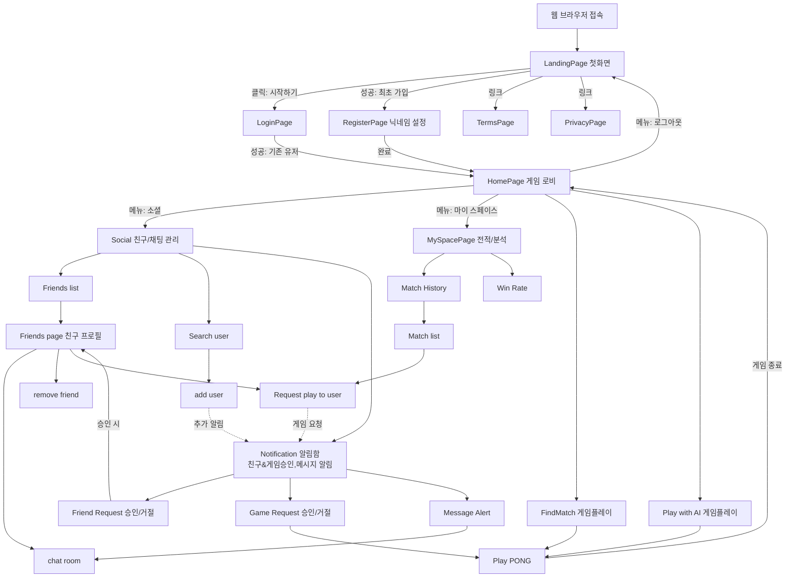

```mermaid
graph TD
    Entry[웹 브라우저 접속] --> Landing[LandingPage 첫화면]
    
    Landing -->|클릭: 시작하기| Login[LoginPage]
    Landing -->|성공: 최초 가입| Register[RegisterPage 닉네임 설정]
    Login -->|성공: 기존 유저| Home[HomePage 게임 로비]
    Register -->|완료| Home

    Home -->|메뉴: 소셜| Social[Social 친구/채팅 관리]
    Home -->|메뉴: 로그아웃| Landing
    Home -->|메뉴: 마이 스페이스| MySpace[MySpacePage 전적/분석]
    Home --> FindMatch[FindMatch 게임플레이]
    Home --> PlaywithAI[Play with AI 게임플레이]
    
    Social --> Friends[Friends list]
    Social --> Search[Search user]
    Social --> Notification[Notification 알림함\n친구&게임승인,메시지 알림]
    Search --> AddUser[add user]
    AddUser -.->|추가 알림| Notification
    Friends --> Friendspage[Friends page 친구 프로필]
    Friendspage --> Message[chat room]
    Friendspage --> RemoveUser[remove friend]
    
    Notification --> GetRequestFriend[Friend Request 승인/거절]
    Notification --> GetRequestPlay[Game Request 승인/거절]
    Notification --> NotificationMessage[Message Alert]

    NotificationMessage --> Message
    GetRequestFriend -->|승인 시| Friendspage

    GetRequestPlay --> Play[Play PONG]
    FindMatch --> Play
    PlaywithAI --> Play
    Play -->|게임 종료| Home
    
    Landing -->|링크| Terms[TermsPage]
    Landing -->|링크| Privacy[PrivacyPage]

    MySpace --> MatchHistory[Match History]
    MySpace --> WinRate[Win Rate]
    MatchHistory --> MatchList[Match list]
    MatchList --> RequestPlay[Request play to user]
    RequestPlay -.->|게임 요청| Notification
    Friendspage --> RequestPlay
```