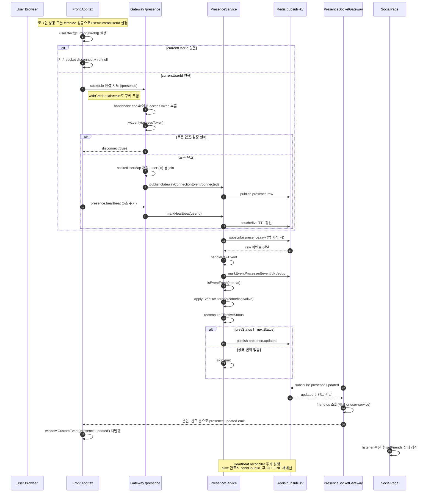

# 내가 구현한 부분

1. 현재 상태 표시 (OFFLINE / ONLINE / MATCHING / IN_GAME)
2. 상태에 따른 기능 제한

# 처음 생각했던 방식

1. 로그인 성공 시 이벤트를 발행하고, 각 기능(매치 시작/종료, 게임 시작/종료) 트리거마다 이벤트를 발행해서 상태를 관리.

# 문제점

1. 현재 상태는 "로그인 했는가"보다 "지금 서버와 연결되어 있는가"가 더 중요하다.
2. 로그인 이벤트만으로는 실시간 연결 끊김(브라우저 종료, 네트워크 끊김, 탭 종료)을 정확히 반영하기 어렵다.
3. 로그인 아웃등의 이벤트만 생각했기 때문에 브라우저 탭 종료하면 상태 안 바뀜 + 로그아웃처리가 안 되어 있어서 새 탭에서 로그인 불가. 


# 최종 구현 방식

1. 웹소켓으로 실시간 연결 상태를 감지한다.
- 웹소켓은 클라이언트와 서버가 연결을 유지하므로, 연결(handleConnection) / 해제(handleDisconnect)를 즉시 감지할 수 있다.

2. heartbeat로 온라인 상태를 보강한다.
- 클라이언트가 주기적으로 heartbeat 이벤트를 보내고,
- 서버는 TTL 기반으로 alive 상태를 유지/만료 처리한다.

3. 이벤트 기반으로 상태 변경을 통합 관리한다.
- 연결/해제, 매치 시작/종료, 게임 시작/종료를 raw 이벤트로 발행한다.
- presence 서비스가 이벤트를 모아 최종 상태를 계산한다.

4. pub/sub 구조를 사용한다.
- 각 서비스는 상태 이벤트를 발행(Publish)하고,
- presence는 이를 구독(Subscribe)해 처리한다.
- 상태가 바뀌면 presence.updated를 다시 발행해서 프론트에 실시간 반영한다.

5. 안전장치를 넣었다.
- dedup(eventId): 같은 이벤트 중복 처리 방지
- freshness(seq, at): 늦게 도착한 오래된 이벤트 무시
- x-internal-token: 내부 API 호출만 허용

# 기대 효과

1. 로그인 여부가 아니라 "실제 접속 상태"를 기준으로 더 정확한 상태 표시가 가능해진다.
2. 기능 제한(예: 매칭/게임 중 프로필 수정 제한)을 상태 기반으로 일관되게 적용할 수 있다.
3. 이후 chat/game 소켓을 분리해도 presence 이벤트만 연동하면 구조를 유지할 수 있다.

---------------------------------------------------------------------

# 상태표시 기능을 하면서 고려했던것

## 1. 왜 WebSocket을 선택?
실시간 상태(연결/해제)를 즉시 반영하려면 WebSocket이 유리하고 또 이후 chat/game도 소켓 기반이라 

## 2. heartbeat 주기(5초)와 TTL(15초)은 어떤 기준으로?
heartbeat는 생존 신호 주기이고, TTL은 신호가 끊겼다고 판단하는 기준임.30초 하려다가 너무 길어서 짧게 잡음

## 3. 브라우저 탭 종료/네트워크 끊김 때 OFFLINE 전환은 얼마나 빨라?
탭 정상 종료는 disconnect 이벤트로 거의 즉시 반영, 네트워크 단절은 disconnect 감지가 늦을 수 있어서 heartbeat TTL 만료 시점(최대 약 15초 + sweep 주기)에서 OFFLINE 처리됩니다.

## 4. connected/disconnected와 heartbeat를 둘 다 쓰는 이유?
disconnect만 사용하면 비정상 종료/네트워크 불안정에서 누락될 수 있고, heartbeat만 사용하면 정상 종료 감지가 느릴 수 있음. 둘을 같이 써서 즉시성과 안정성을 함께 확보함.

## 5. dedup(eventId) 없으면 어떤 버그가 나와?
같은 이벤트가 재전송될 때 중복 처리되어 상태가 흔들릴 수 있음. 예를 들어 connected가 중복 처리되면 연결 수(connCount)가 틀어질 수 있습니다.

## 6. freshness(seq, at) 체크가 없으면 어떤 문제가 생겨?
늦게 도착한 오래된 이벤트가 최신 상태를 덮어쓸 수 있습니다. 예를 들어 이미 ONLINE인데 늦게 도착한 disconnected가 적용되어 OFFLINE으로 되돌아갈 수 있습니다.

## 7. x-internal-token은 왜 사용?
기본적인 내부 호출 보호에는 유효하지만 단독으로 완전하진 않습니다. 실무에서는 내부 네트워크 제한, TLS, 서비스 간 인증(mTLS 등)과 함께 사용하는 것이 더 안전합니다.

## 10. 로그인 중복 제한과 presence 상태는 어떻게 맞물려 동작해?
로그인 시 presence 상태가 OFFLINE인지 확인하고, OFFLINE이 아니면 중복 로그인을 차단. 
그리고 연결이 끊기면 로그아웃 하도록 해둠.

## 12. chat/game 소켓 분리 후 presence와의 연동 방식은?
chat/game 서버는 상태 변화 시 raw 이벤트만 발행하고, 최종 상태 계산은 presence 서비스가 단일 책임으로 처리하는 구조를 유지.

## 13. MATCHING은 내부 상태인데 왜 외부에는 ONLINE으로?
MATCHING은 내부 제어용 상태이고, 사용자에게는 단순한 상태 모델(ONLINE/IN_GAME/OFFLINE)만 노출하기 위해서

## 14. 상태 기반 기능 제한(프로필 수정/친구 요청 차단)은 어디서 검사해?
user-service의 각 비즈니스 함수에서 presence 내부 API를 조회해 조건으로 차단.


-----------------------
## 상태표시 기능 Mermaid 차트 




# 상태표시 기능 코드 흐름

## 1. 프론트가 소켓 연결/heartbeat 시작
0. 로그인 하면서 유저 상태가 변하면 함정카드 발동처럼 이 로직이 시작됨. 
1. 상태표시 로직 시작: 
2. 소켓 연결: 
3. heartbeat 전송
4. `presence.updated` 수신 후 브라우저 이벤트 재발행


```
App.tsx에 있음. 

  // 상태표시 기능 
  useEffect(() => {
    // 로그인 안 된 상태면 기존 소켓 연결을 끊고 ref를 초기화
    if (!currentUserId) {
      presenceSocketRef.current?.disconnect();
      presenceSocketRef.current = null;
      return;
    }
    // 로그인 되어 있고 이미 소켓 있으면 넘어가기
    if (presenceSocketRef.current) {
      return;
    }
    // 최초 로그인이면 게이트웨이의 네임스페이스로 웹소켓 연결 만들기
    const socket = io(PRESENCE_SOCKET_URL, {
      withCredentials: true,
      transports: ['websocket'], // 쿠키를 포함시킴
    });// 비정상을 감지할 타이머 설정.
    const heartbeatTimer = window.setInterval(() => {
      socket.emit('presence.heartbeat');
    }, 5000); 
    socket.emit('presence.heartbeat');  // 연결확인 보조용
    // 게이트웨이의 소켓을 받으면 프론트 내에 전역으로 뿌려서 소셜페이지가 받아보게 함
    socket.on('presence.updated', (event) => {
      window.dispatchEvent(
        new CustomEvent(PRESENCE_UPDATED_EVENT, {
          detail: event,
        }),
      );
    });
    // 세션만료, 로그아웃 등 이전 소켓/타이머가 남지 않게 치우는 코드
    presenceSocketRef.current = socket;
    return () => {
      window.clearInterval(heartbeatTimer);
      socket.disconnect();
      if (presenceSocketRef.current === socket) {
        presenceSocketRef.current = null;
      }
    };
  }, [currentUserId]);

  const handleUnauthenticated = useCallback(() => {
    const isIntentLogout = sessionStorage.getItem('intent_logout') === '1';
    if (isIntentLogout) {
      sessionStorage.removeItem('intent_logout');
      return;
    }
    setSessionExpiredOpen(true);
  }, []);
```
## 2. 소셜 페이지가 상태 업데이트 반영
1. 구독 시작:
2. 친구 배열 상태 갱신: (프론트 렌더링 비용은 상대적으로 작고, 서버 쪽 친구 상태 조회 N+1이 더 큰 비용 포인트)
3. 상태 점 색상 렌더: 

```
frontend/src/pages/SocialPage.tsx 

  // presence.updated 실시간 구독: 친구 목록의 상태 점을 즉시 갱신
  useEffect(() => {
    const handlePresenceUpdated = (evt: Event) => {
      const event = (evt as CustomEvent<PresenceUpdatedPayload>).detail; // 누구의 상태가 무엇으로 바뀌었는지 
      if (!event) return;
      setFriends((prev) => // 친구목록에서 이벤트로 받은 아이디 찾아서 상태 변경
        prev.map((friend) =>
          friend.userId === event.userId
            ? { ...friend, status: event.publicStatus }
            : friend,
        ),
      );
    };
    // 상태변경 관련 이벤트 구독
    window.addEventListener(
      PRESENCE_UPDATED_EVENT,
      handlePresenceUpdated as EventListener,
    );
    // 이벤트 받아서 상태 받은 뒤에는 다시 새로운 이벤트를 받을 준비. 
    return () => {
      window.removeEventListener(
        PRESENCE_UPDATED_EVENT,
        handlePresenceUpdated as EventListener,
      );
    };
  }, []);

```

## 3. 게이트웨이 소켓에서 연결/해제 감지
1. 소켓 인증 + 유저 룸 조인: `presence.socket.gateway.ts` (line 33)
2. heartbeat 수신 처리: `presence.socket.gateway.ts` (line 48)
3. 연결 이벤트 발행: `presence.socket.gateway.ts` (line 52)
4. 해제 이벤트 발행: `presence.socket.gateway.ts` (line 63)

```
gateway/src/presence/presence.socket.gateway.ts

  async handleConnection(client: Socket) {
    const token = this.extractAccessToken(client);
    if (!token) {
      client.disconnect(true);
      return;
    } // 토큰 확인
    try {
      const payload = jwt.verify(token, process.env.MY_SECRET_KEY ?? '') as { sub?: string };
      const userId = String(payload?.sub ?? '');
      if (!userId) {
        client.disconnect(true);
        return;
      } // 토큰에 맞는 유저 아이디 불러오기 
      this.socketUserMap.set(client.id, userId);
      client.join(`user:${userId}`);
      client.on('presence.heartbeat', async () => {
        await this.presenceService.markHeartbeat(userId);
      }); 
      // 이벤트 발생: 실제 WS 연결 생성 시 connected 발행
      await this.presenceService.publishGatewayConnectionEvent(userId, 'connected');
    } catch {
      client.disconnect(true);
    }
  }
```


## 4. Presence 서비스가 이벤트 소비 후 상태 계산
0. 이벤트 받고 > 상태갱신 > 발행. gateway/src/presence/presence.service.ts
1. 이벤트 수신 
2. 검증 + 오케스트레이션
3. 상태 저장
4. 상태 반영(connected/disconnected/matching/game)
5. 최종 상태 계산
6. 상태 변경 시 `presence.updated` 발행

7. 받는곳 : 게이트웨이 내부 (상태 업데이트), 프론트웨이 소켓 수신처 > 소셜페이지 (상태 가져와서 반영) 

## 5. heartbeat 만료 정리(OFFLINE 전환)
1. reconcile 루프
2. alive 없으면 connCount 0 처리 후 상태 재계산

## 6. Redis 저장값 확인
0. presence.redis.ts
1. connCount
2. effective 상태
3. dedup 키 저장
4. alive TTL: `presence.redis.ts` 


--------------------------------------------------------------

## 상세 차트 순서 설명 (발표용)

1. 로그인 성공(또는 `fetchMe` 성공)
- `user/currentUserId`가 세팅됩니다.
- 이게 `App.tsx`의 `useEffect([currentUserId])` 트리거입니다.

2. 프론트가 `/presence` 소켓 연결 시도
- `withCredentials: true`라서 쿠키(`accessToken`)를 같이 보냅니다.

3. 게이트웨이가 소켓 핸드셰이크 인증
- 쿠키에서 `accessToken` 추출 → `jwt.verify`.
- 실패하면 즉시 disconnect, 성공하면 진행.

4. 인증 성공 시 유저 소켓 등록
- `socketUserMap`에 `client.id -> userId` 저장
- `user:{userId}` 룸에 join

5. 게이트웨이가 `connected` raw 이벤트 발행
- `publishGatewayConnectionEvent('connected')` 호출
- `presence.raw` 채널로 이벤트가 나갑니다.

6. 프론트는 heartbeat를 5초마다 송신
- `presence.heartbeat` 이벤트를 계속 보냄
- 게이트웨이는 이를 받아 `markHeartbeat`로 alive TTL 갱신

7. PresenceService가 `presence.raw`를 구독/수신
- 이벤트 들어오면 `handleRawEvent` 진입

8. 이벤트 검증 1: dedup
- `eventId`가 이미 처리된 이벤트면 버림

9. 이벤트 검증 2: freshness
- `seq/at` 기준으로 오래된 이벤트면 버림

10. 상태 저장 반영
- 이벤트 타입에 따라 connCount/alive/flags를 Redis에 반영

11. 최종 상태 계산
- `IN_GAME > MATCHING > ONLINE > OFFLINE` 우선순위로 계산

12. 상태가 바뀐 경우만 `presence.updated` 발행
- 안 바뀌면 발행 생략

13. PresenceSocketGateway가 `presence.updated` 구독
- 이벤트 수신 후 대상 룸 계산(본인 + 친구)

14. 게이트웨이가 본인+친구에게만 emit
- 전체 브로드캐스트 안 하고 필요한 사용자에게만 전송

15. 프론트 수신 후 UI 반영
- `App.tsx`가 이벤트 받아 `window CustomEvent` 재발행
- `SocialPage`가 받아 `setFriends`로 상태 점 갱신

16. 보정 루프(heartbeat reconciler)
- 주기적으로 alive 만료 유저 검사
- 만료면 connCount=0 처리 후 OFFLINE 재계산/발행
- disconnect 누락돼도 결국 정합성 맞춤
